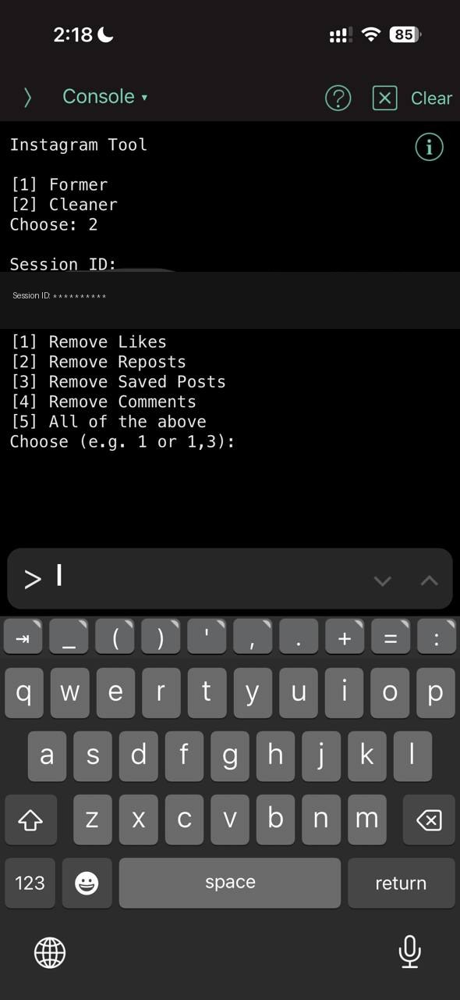

# cleaner_former_tool

A small command-line utility for Instagram accounts. It runs two modes over the
account session directly, with no proxy involved.

- **Former** — repeatedly changes the account's profile picture in a loop. It
  runs as fast as the API allows and only pauses when it gets rate-limited.
- **Cleaner** — bulk-removes your own likes, reposts, saved posts, and comments.

## Requirements

```
pip install requests
```

## Usage

```
python cleaner_former_tool.py
```

Pick a mode, paste the account `sessionid`, and follow the prompts.

- **Former** — remove your current profile picture before you start, then let it
  run. Stop any time with `Ctrl+C`.
- **Cleaner** — choose one or more actions (e.g. `1`, `1,3`, or `5` for all).

## Demo


